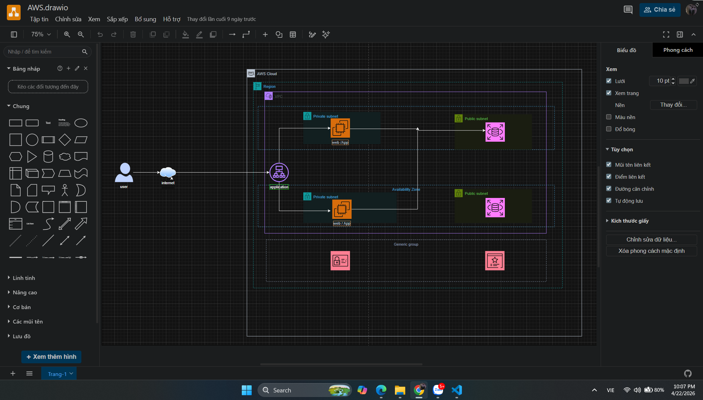
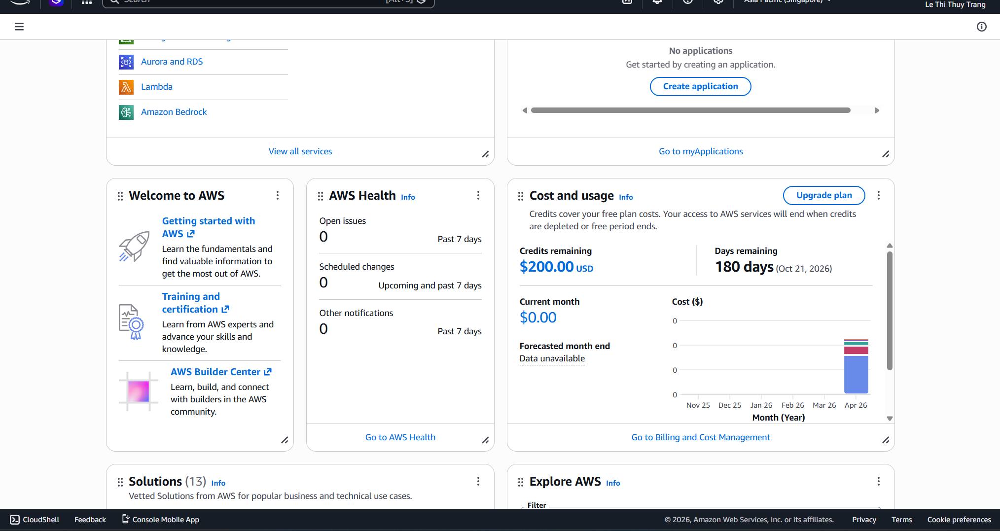

### Mục tiêu tuần 1:
* Kết nối, làm quen với các thành viên trong First Cloud Journey.
* Hiểu dịch vụ AWS cơ bản, cách dùng console & CLI.
* Nắm vững kiến thức nền tảng về điện toán đám mây AWS, hạ tầng toàn cầu và triết lý vận hành.
* Trang bị bộ kỹ năng bổ trợ: Sử dụng **Visual Studio Code**, viết tài liệu bằng **Markdown**.
* Thành thạo phần mềm **Draw.io** để vẽ sơ đồ kiến trúc hệ thống chuẩn xác.
* Tự xây dựng lộ trình phát triển cho kỹ sư đám mây (Cloud Engineer).

### Các công việc cần triển khai trong tuần này:

| Thứ | Công việc | Ngày bắt đầu | Ngày hoàn thành | Nguồn tài liệu |
| --- | --------- | ------------ | --------------- | -------------- |
| 2 | - Tìm hiểu tổng quan AWS: Hạ tầng toàn cầu, Region, AZs.   - Nghiên cứu triết lý vận hành và lộ trình Cloud Engineer. | 17/04/2026 | 17/04/2026 | AWS Study Group |
| 3 | - Thiết lập môi trường làm việc với **Visual Studio Code**.   - Học cú pháp **Markdown** để viết nội dung Workshop. | 18/04/2026 | 18/04/2026 | Hugo/Markdown Guide |
| 4 | - Thực hành vẽ sơ đồ kiến trúc trên **Draw.io**.   - Tìm hiểu phương pháp tối ưu hóa chi phí (Cost Optimization). | 19/04/2026 | 19/04/2026 | Draw.io AWS Icons |
| 5 | - Khởi tạo tài khoản AWS và thực hành quản lý dịch vụ cơ bản.   - Áp dụng quy chuẩn thiết kế hệ thống tối ưu. | 20/04/2026 | 20/04/2026 | AWS Workshop |
| 6 | - Hoàn thiện dự án cá nhân đầu tiên và viết báo cáo trên trang Hugo. | 24/04/2026 | 24/04/2026 | Cá nhân |

### Kết quả đạt được tuần 1:

* **Về Kiến thức AWS:**
    * Hiểu rõ cách thức vận hành của hạ tầng toàn cầu và các nhóm dịch vụ cốt lõi.
    * Nắm vững phương pháp quản lý dịch vụ và tối ưu hóa chi phí thực tế.
* **Về Công cụ & Kỹ năng thực thi:**
    * Sử dụng thành thạo **Markdown** để trình bày nội dung workshop một cách chuyên nghiệp trên nền tảng Hugo.
    * Có khả năng thiết kế sơ đồ kiến trúc hệ thống trên **Draw.io** đúng quy chuẩn kỹ thuật.
    * Tự tin triển khai các dự án cá nhân và áp dụng công nghệ AWS vào môi trường thực tế.
* **Về Bài Lab đã Thực Hành:**
* Thiết kế sơ đồ kiến trúc hệ thống trên **Draw.io**
* 
* **Hoàn Thành 5 bài lab lấy được $200.000 USD**
  
{}
**Tóm tắt:** Tuần 1 giúp chuyển hóa từ lý thuyết thuần túy sang kỹ năng thực thi chuyên sâu, tạo tiền đề để trở thành một Cloud Engineer chuyên nghiệp.
{}

