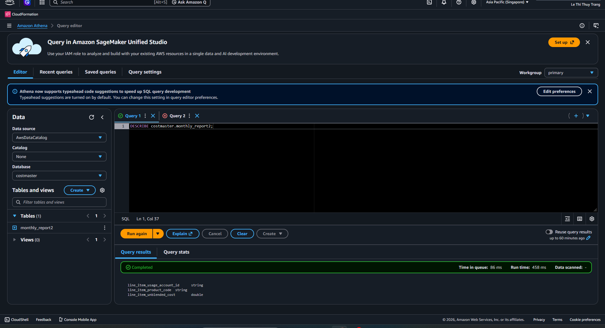
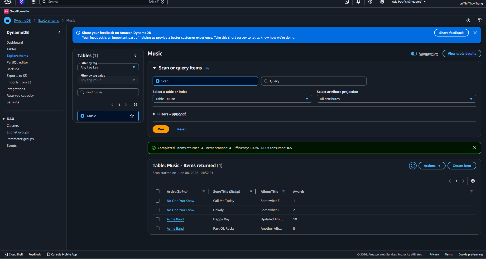

### Mục tiêu tuần 11:
* Tìm hiểu kiến trúc **Data Lake** trên AWS và vai trò của Amazon S3 trong việc lưu trữ dữ liệu tập trung.
* Làm chủ quy trình quản lý và xử lý dữ liệu bằng **AWS Glue**, bao gồm Data Catalog, Crawler và ETL Job.
* Thực hành truy vấn dữ liệu bằng **Amazon Athena** và trực quan hóa dữ liệu với **Amazon QuickSight**.
* Xây dựng hệ thống phân tích dữ liệu theo mô hình **Serverless Data Analytics** trên AWS.
* Nâng cao khả năng triển khai, quản trị và tối ưu hệ thống dữ liệu phục vụ nhu cầu phân tích và báo cáo doanh nghiệp.

### Các công việc cần triển khai trong tuần này:

| Thứ | Công việc | Ngày bắt đầu | Ngày hoàn thành | Nguồn tài liệu |
|------|-----------|--------------|----------------|----------------|
| 2 | - Tìm hiểu tổng quan về kiến trúc **Data Lake trên AWS (Lab 000040)**.   - Nghiên cứu vai trò của Amazon S3 trong lưu trữ dữ liệu tập trung và khả năng mở rộng của Data Lake. | 22/06/2026 | 22/06/2026 | Lab 000040 |
| 3 | - Thực hành tạo và cấu hình **AWS Glue Database**.   - Tìm hiểu cơ chế quản lý metadata với Glue Data Catalog.   - Khởi tạo Glue Crawler để tự động phát hiện cấu trúc dữ liệu. | 23/06/2026 | 23/06/2026 | Lab 000040 |
| 4 | - Thực hành truy vấn dữ liệu bằng **Amazon Athena**.   - Đánh giá khả năng phân tích dữ liệu trực tiếp trên Amazon S3 mà không cần hệ quản trị cơ sở dữ liệu riêng. | 24/06/2026 | 24/06/2026 | Lab 000040 |
| 5 | - Tìm hiểu quy trình **ETL với AWS Glue (Lab 000060)**.   - Tạo và thực thi Glue Job để làm sạch, chuyển đổi và xử lý dữ liệu.   - Đánh giá khả năng tự động hóa xử lý dữ liệu trên AWS. | 25/06/2026 | 25/06/2026 | Lab 000060 |
| 6 | - Theo dõi và kiểm thử kết quả ETL.   - Quản lý dữ liệu đầu ra trên Amazon S3.   - Đánh giá hiệu quả của AWS Glue trong quy trình xử lý dữ liệu quy mô lớn. | 26/06/2026 | 26/06/2026 | Lab 000060 |
| 7 | - Thực hành **Amazon QuickSight (Lab 000070)**.   - Kết nối QuickSight với Athena để tạo Dataset.   - Xây dựng biểu đồ, Dashboard và báo cáo trực quan phục vụ phân tích dữ liệu. | 27/06/2026 | 27/06/2026 | Lab 000070 |
| CN | - Tổng hợp hình ảnh thực hành và rà soát cấu hình S3, Glue, Athena và QuickSight.   - Hoàn thiện báo cáo tuần 11.   - Tổng kết kiến thức về Data Lake, ETL và Data Visualization trên AWS. | 28/06/2026 | 28/06/2026 | AWS Study Group & Cá nhân |

### Kết quả đạt được tuần 11:

#### Data Lake & Quản lý dữ liệu:

* Hiểu rõ kiến trúc **Data Lake** và cách triển khai hệ thống lưu trữ dữ liệu tập trung trên AWS.
* Nắm được vai trò của **Amazon S3** trong việc lưu trữ dữ liệu có cấu trúc và phi cấu trúc.
* Hiểu cơ chế quản lý metadata thông qua **AWS Glue Data Catalog**.
* Thực hành thành công việc sử dụng **Glue Crawler** để tự động phát hiện và lập danh mục dữ liệu.

#### ETL & Xử lý dữ liệu:

* Tìm hiểu và triển khai quy trình **ETL (Extract - Transform - Load)** bằng AWS Glue.
* Tạo và thực thi **AWS Glue Job** để xử lý và chuyển đổi dữ liệu.
* Hiểu được cách tự động hóa quá trình xử lý dữ liệu trong môi trường Cloud.
* Đánh giá được lợi ích của việc sử dụng dịch vụ serverless trong xử lý dữ liệu quy mô lớn.

#### Phân tích dữ liệu:

* Thực hiện truy vấn dữ liệu bằng **Amazon Athena** trực tiếp trên dữ liệu lưu trữ trong Amazon S3.
* Hiểu được cơ chế phân tích dữ liệu không máy chủ (Serverless Analytics).
* Đánh giá hiệu quả và khả năng mở rộng của Athena trong các hệ thống dữ liệu lớn.
* Nắm được quy trình khai thác dữ liệu phục vụ báo cáo và phân tích nghiệp vụ.

#### Trực quan hóa dữ liệu:

* Kết nối thành công **Amazon QuickSight** với nguồn dữ liệu Athena.
* Xây dựng các biểu đồ và Dashboard phục vụ phân tích dữ liệu.
* Trực quan hóa dữ liệu theo nhiều góc nhìn khác nhau để hỗ trợ ra quyết định.
* Hiểu được vai trò của Business Intelligence trong hệ thống dữ liệu hiện đại.

#### Tối ưu hệ thống dữ liệu trên AWS:

* Hiểu được cách kết hợp Amazon S3, AWS Glue, Athena và QuickSight để xây dựng hệ thống phân tích dữ liệu hoàn chỉnh.
* Nắm được quy trình từ lưu trữ, xử lý, truy vấn đến trực quan hóa dữ liệu trên AWS.
* Đánh giá khả năng mở rộng, tính linh hoạt và tối ưu chi phí của mô hình Data Analytics Serverless.
* Nâng cao kỹ năng triển khai và quản trị hệ thống dữ liệu trên nền tảng AWS Cloud.
* **Module 07-Lab40 - Preparing the database**
 
* **Module 07-Lab60-1 - CLoudShell.2.2**
 
