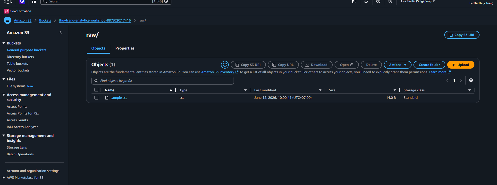
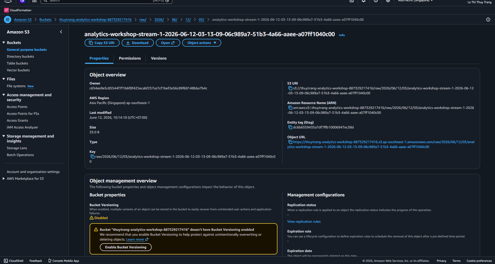
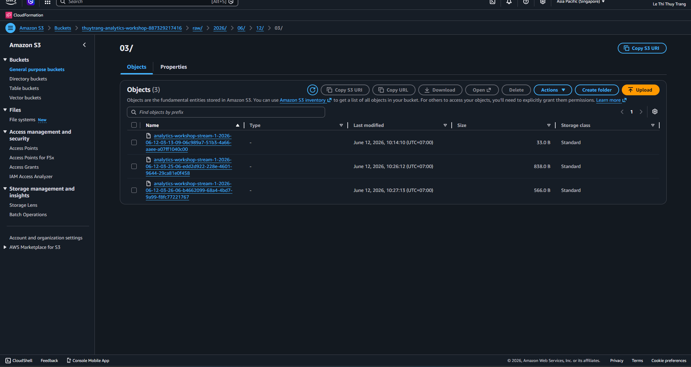
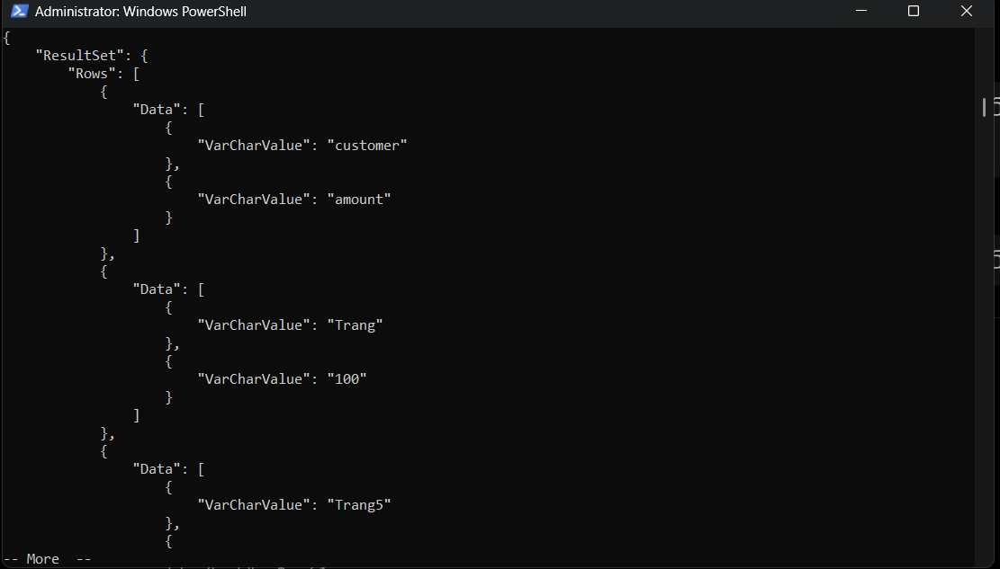
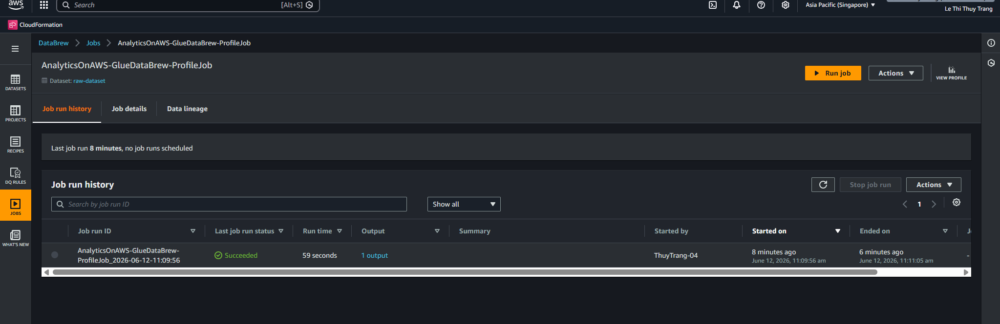
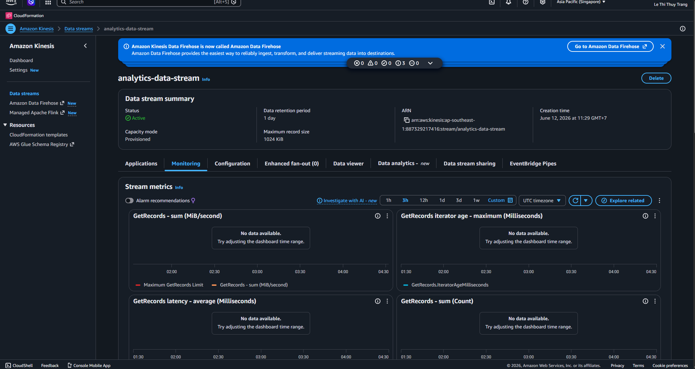
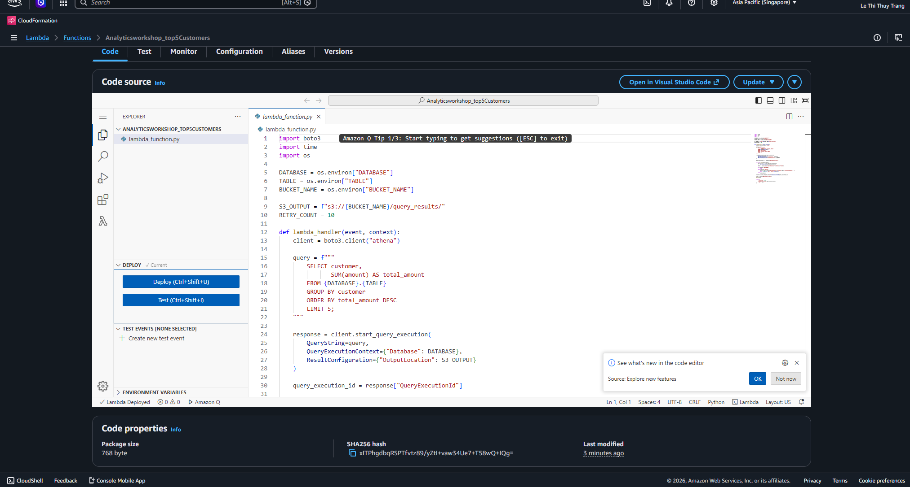

### Week 12 Objectives:

* Learn the **Data Preparation** process on AWS for data analytics systems.
* Master **AWS Glue DataBrew** to clean, transform, and standardize data without coding.
* Practice building and managing a **Data Warehouse** with **Amazon Redshift**.
* Understand data storage, extraction, and analysis workflows in an enterprise environment.
* Improve the ability to deploy analytics and Business Intelligence solutions on AWS.

### Tasks to complete this week:

| Day | Task | Start date | Completion date | Reference |
|------|------|------------|----------------|-----------|
| 2 | - Learn the overview of data preparation and its role in analytics systems.   - Study AWS Glue DataBrew features. | 29/06/2026 | 29/06/2026 | Lab 000072 |
| 3 | - Create a Dataset on AWS Glue DataBrew.   - Explore data and evaluate input data quality.   - Learn the DataBrew interface and visual data processing tools. | 30/06/2026 | 30/06/2026 | Lab 000072 |
| 4 | - Clean data by handling missing, duplicate, and invalid values.   - Build a Recipe to automate the transformation process. | 01/07/2026 | 01/07/2026 | Lab 000072 |
| 5 | - Learn Data Warehouse architecture and the role of Amazon Redshift in analytics systems.   - Create and configure an Amazon Redshift Cluster. | 02/07/2026 | 02/07/2026 | Lab 000073 |
| 6 | - Load data into Amazon Redshift.   - Query data with SQL for analysis and reporting.   - Evaluate storage and query performance on Redshift. | 03/07/2026 | 03/07/2026 | Lab 000073 |
| 7 | - Aggregate data for business analysis.   - Check processing results and evaluate data quality after transformation. | 04/07/2026 | 04/07/2026 | Lab 000072 & 000073 |
| Sun | - Collect lab screenshots and review AWS Glue DataBrew and Amazon Redshift configurations.   - Complete the week 12 report.   - Summarize knowledge of Data Preparation and Data Warehouse on AWS. | 05/07/2026 | 05/07/2026 | AWS Study Group & Personal |

### Results achieved:

* Understood the role of Data Preparation in the data analytics process.
* Used AWS Glue DataBrew to clean, transform, and standardize data.
* Created and managed Dataset, Recipe, and Job on DataBrew.
* Deployed and managed a data warehouse with Amazon Redshift.
* Queried and analyzed data in a Data Warehouse environment.
* Understood the workflow from data preparation to storage and data extraction for Business Intelligence.

### Week 12 Summary:

* Week 12 focused on two important topics in AWS Data Analytics: data preparation with AWS Glue DataBrew and data warehouse construction with Amazon Redshift. Through the labs, I became familiar with the process of cleaning, standardizing, and transforming data before loading it into an analytics system. I also successfully deployed a Data Warehouse environment on Amazon Redshift and ran analytical SQL queries. The knowledge and skills gained this week form an important foundation for building large-scale Business Intelligence and data analytics systems on AWS.
* **Preparatory steps**:
* **Create S3 bucket**
  
* **Creating Kinesis Firehose**
  
* **Generate Dummy Data**
  
  
  
  
  
