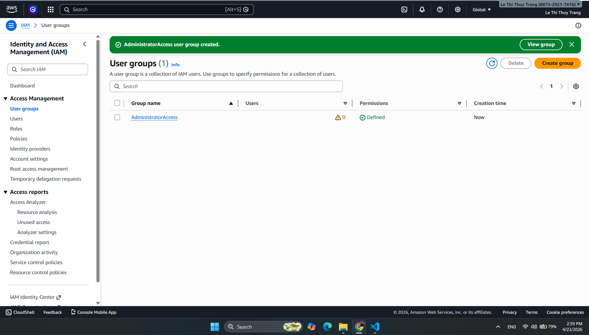
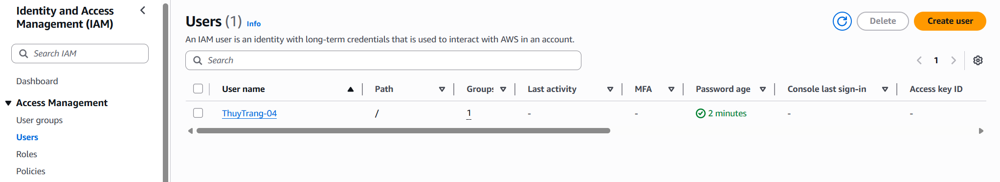
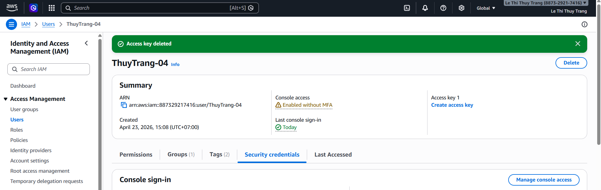
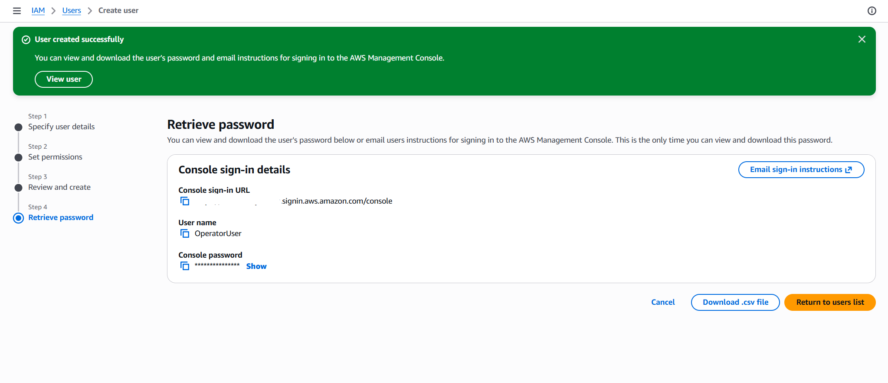

### Objectives for this week:

* Complete the registration and identity verification process for an AWS Free Tier account.
* Deploy optimal security layers, especially MFA, to protect the Root account.
* Practice professional system administration through IAM, including user groups and permission management.

### Tasks to complete this week:

| Day | Task | Start date | Completion date | Reference |
| --- | ---- | ---------- | --------------- | --------- |
| 2 | - Prepare personal information and an international payment card.   - Complete the AWS Free Tier account registration process. | 20/04/2026 | 20/04/2026 | AWS Documentation |
| 3 | - Enable multi-factor authentication (**MFA**) for the Root account.   - Learn security risks related to exposed passwords. | 21/04/2026 | 21/04/2026 | AWS Security Blog |
| 4 | - Create an **Admin Group** and an **IAM User**.   - Assign permissions appropriately based on the Least Privilege principle. | 22/04/2026 | 22/04/2026 | AWS Study Group |
| 5 | - Create and configure **Access Keys** for CLI access.   - Practice managing security policies. | 23/04/2026 | 23/04/2026 | AWS Workshop |
| 6 | - Review the entire security configuration and complete the lab report. | 24/04/2026 | 24/04/2026 | Personal |
| 7 | - Learn about AWS Support Plans. | 25/04/2026 | 25/04/2026 | Personal |

### Results achieved:

* **Account security:**
    * Strengthened account protection through **MFA**, reducing the risk of exposed credentials.
    * Understood why the Root account should not be used for daily operations.
* **System administration (IAM):**
    * Practiced creating **Admin Group** and **IAM User** to manage people and cloud resources in an organized way.
    * Learned how to use **Access Keys** to operate resources through the command line professionally.
    * Learned how to apply security policies so permissions are granted to the right people for the right tasks.
* **Created **Admin Group**, **Admin User**, and **IAM User**:**
* 
* 
* 
* 
* Creating Operator User
* 

### Learning about AWS Support Plans

In addition to technical setup, choosing an appropriate support plan is an important factor for keeping systems stable around the clock based on business needs and budget.

#### Four main support levels:

| Support plan | Key characteristics | Suitable for |
| :--- | :--- | :--- |
| **Basic** | Free by default, with support for account, billing, and customer service issues. | Everyone getting started. |
| **Developer** | Adds architectural guidance and faster response times. | Testing and development environments. |
| **Business** | Includes automated system checks through Trusted Advisor to optimize cost and security. | Production systems. |
| **Enterprise** | Provides a Technical Account Manager (TAM) and 24/7 direct support for complex problems. | Large enterprises and mission-critical systems. |

#### Research results:

* **Flexibility:** AWS allows users to choose and change support plans flexibly as a project evolves.
* **Support resources:** In addition to direct support channels, AWS provides extensive technical documentation and an active community forum for troubleshooting and system optimization.
* **Core value:** Support plans are not limited to fixing issues; they also focus on long-term architecture and security guidance.

{}
**Recommendation:** For students or beginners like us, the **Basic** plan combined with **AWS Documentation** is the best way to learn without additional cost.
{}

{}
**Important note:** Always store Access Keys and MFA information securely. Never share them in public repositories such as GitHub.
{}
