### Week 3 Objectives:

* Understand the concept of **Amazon VPC** and how to set up an isolated virtual network environment.
* Become proficient in IP management, subnet planning, and route table configuration.
* Deploy network security layers: **Security Groups** and **Network ACLs**.
* Learn internet connectivity and hybrid infrastructure options such as Internet Gateway, NAT Gateway, and VPN.
* Study advanced solutions such as VPC Peering and Elastic Load Balancing (ELB).
* Deploy network components including **Subnet**, **Internet Gateway**, and **Route Table**.
* Manage **EC2** servers securely through **NAT Gateway** and **Instance Connect Endpoint**.

### Tasks to complete this week:

| Day | Task | Start date | Completion date | Reference |
| --- | ---- | ---------- | --------------- | --------- |
| 2 | - Learn the VPC overview, IP address ranges (CIDR), and subnet segmentation.   - Configure route tables for internal traffic. | 27/04/2026 | 27/04/2026 | AWS Networking Guide |
| 3 | - Set up internet connectivity through an **Internet Gateway** for the Public Subnet.   - Configure **NAT Gateway** so the Private Subnet can access the internet. | 28/04/2026 | 28/04/2026 | AWS Documentation |
| 4 | - Practice security configuration with **Security Groups** (stateful) and **NACLs** (stateless).   - Compare how these two security layers operate. | 29/04/2026 | 29/04/2026 | Security Essentials |
| 5 | - Study advanced connectivity: **VPC Peering**, **VPN**, and **Transit Gateway**.   - Learn **Elastic Load Balancing (ELB)** to improve availability.   - Differentiate between Security Group (stateful) and Network ACL (stateless). | 30/04/2026 | 30/04/2026 | AWS Study Group |
| 6 | - **Advanced practice:** Configure **NAT Gateway** for a Private Subnet.   - Set up **EC2 Instance Connect Endpoint** for secure remote administration. | 1/05/2026 | 1/05/2026 | AWS Workshop |

### Results achieved in week 3:

* **Network system thinking:**
    * Built the ability to set up a secure, isolated virtual network environment in the cloud.
    * Understood how to control inbound and outbound traffic through two defense layers: Security Groups and NACLs.
* **Implementation skills:**
    * Learned how to connect cloud resources to the internet or on-premises infrastructure through VPN/Direct Connect.
    * Understood how load balancers improve application scalability.
    * Practiced troubleshooting basic VPC connectivity and routing issues.
* **Create VPC:**
  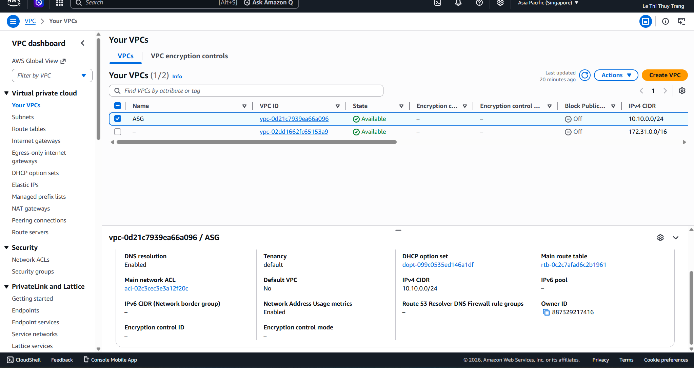
* **Create Subnet:**
  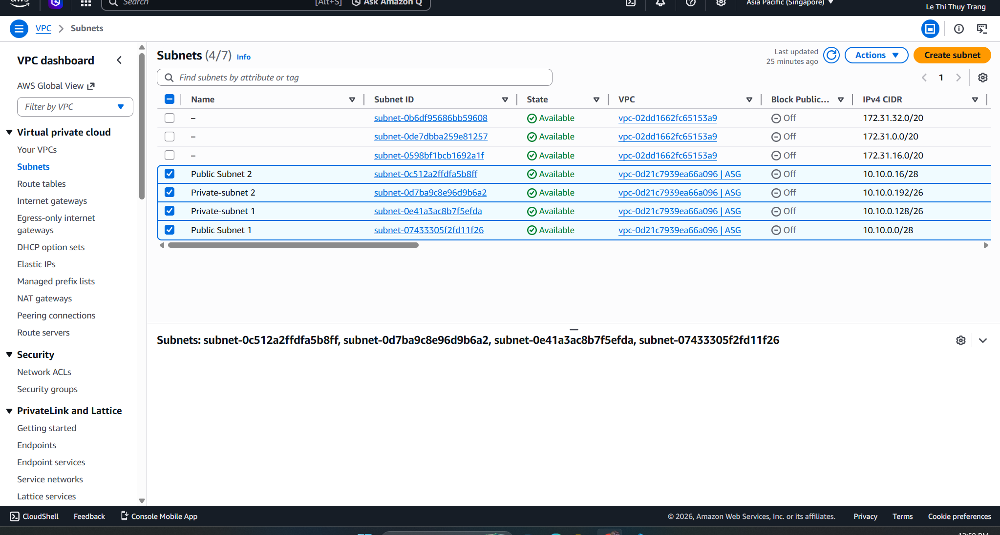
* **Create Internet gateways:**
  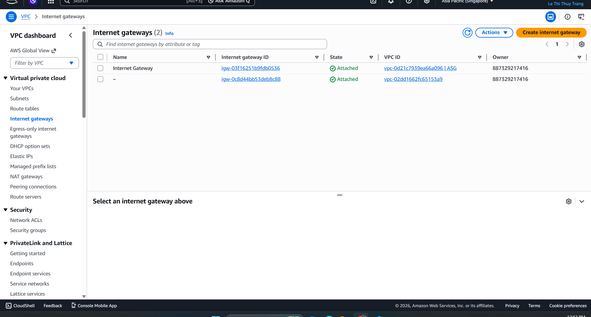
* **Create Route tables:**
  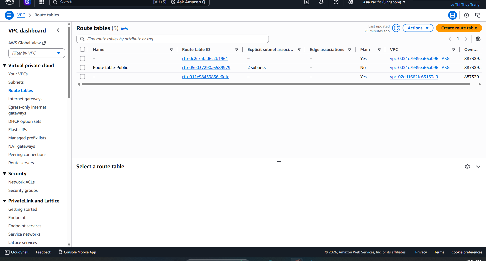
* **Create Security Groups:**
  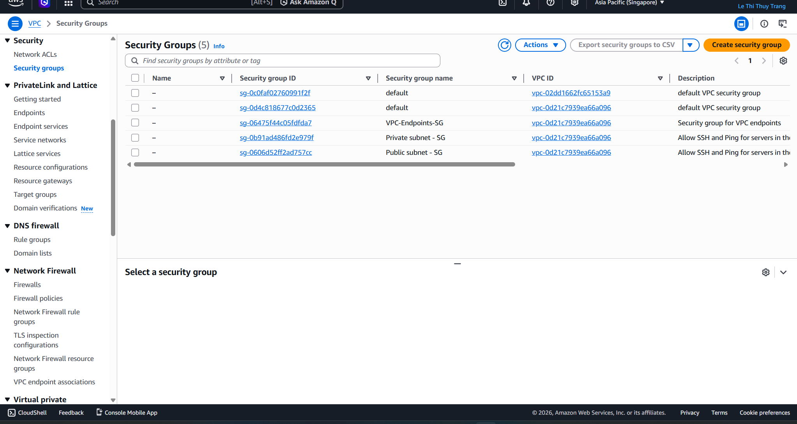
* **Create EC2:**
  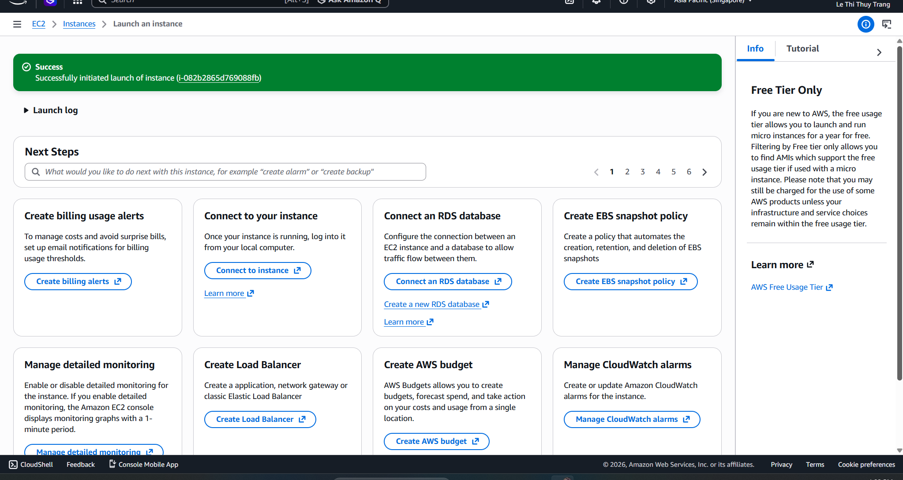
  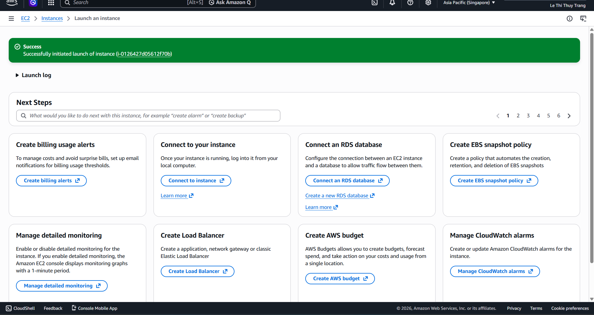
  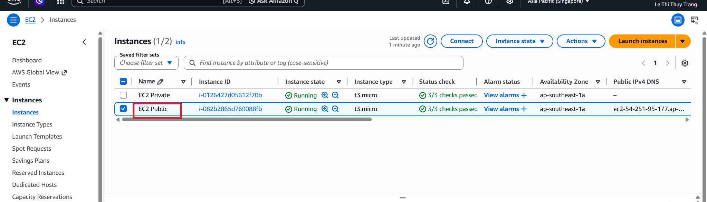
  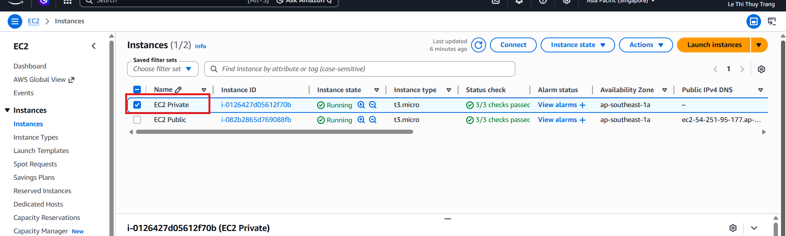
  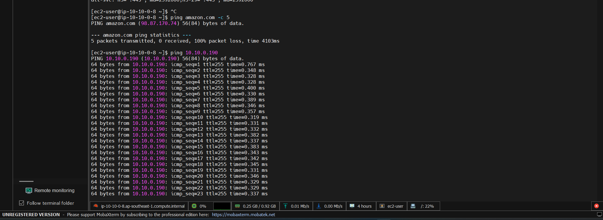
  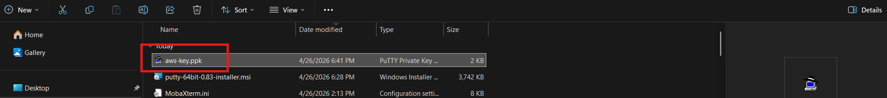
  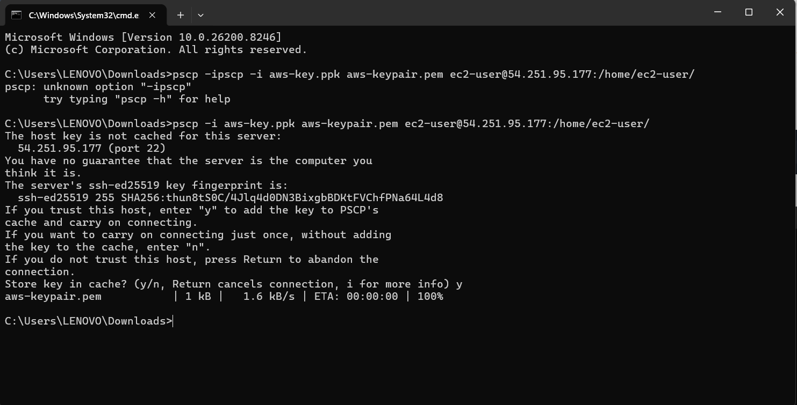
  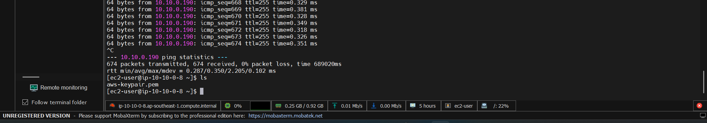
  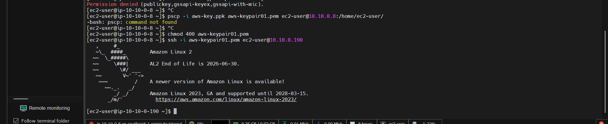
* **Create NAT Gateways:**
  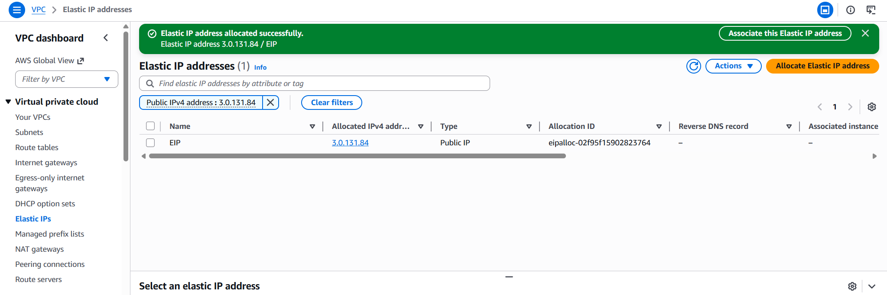
  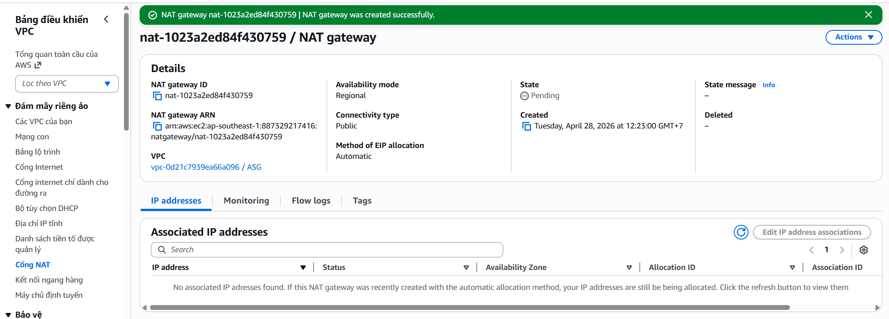
  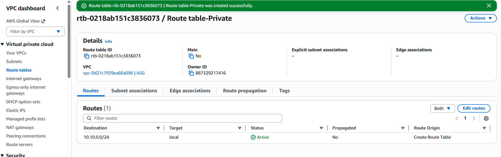
  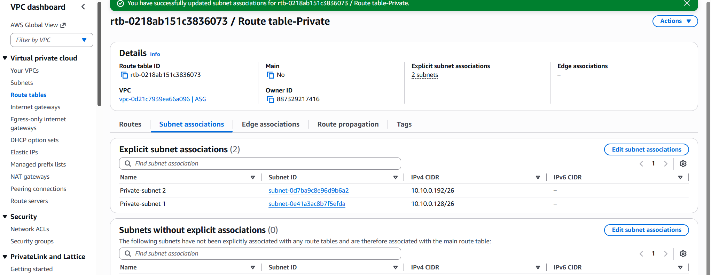
  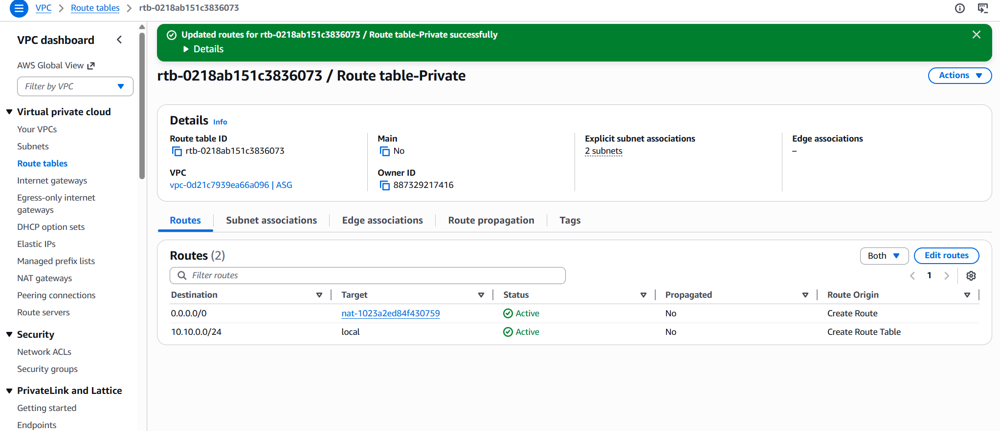
  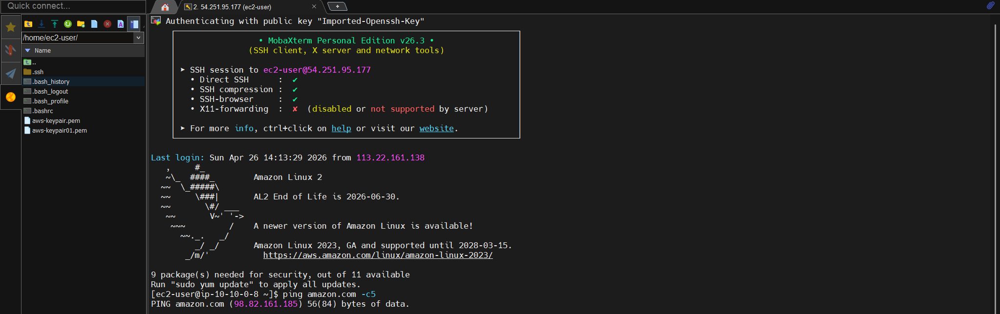
* **Create EC2 Instance Connect Endpoint:**
  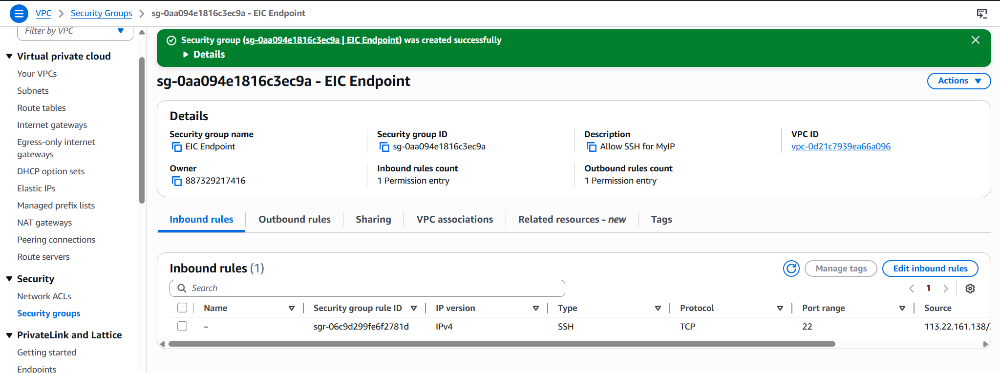
  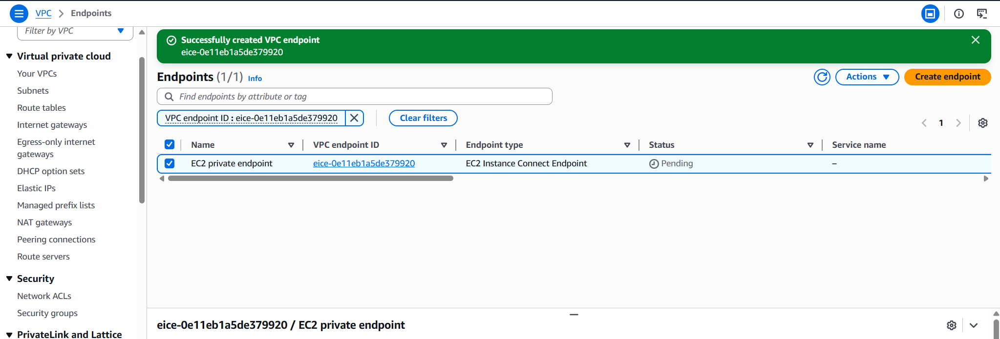
  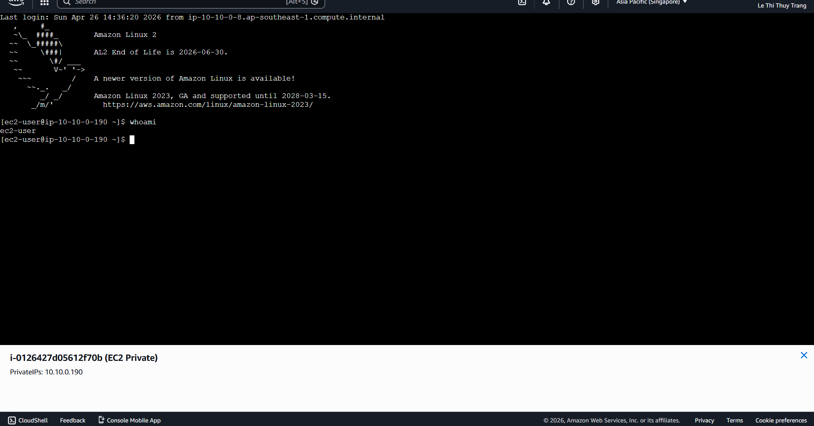

{}
**Summary:** Mastering VPC provides a solid foundation for deploying services such as EC2 and RDS securely and efficiently.
{}
