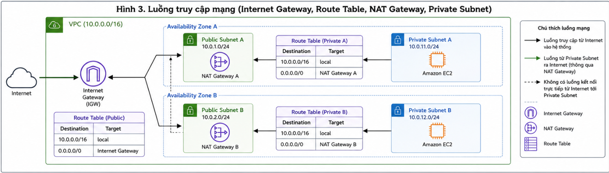

# From Requirements to Architecture: Designing a Web System on AWS

When I first started learning AWS, I spent a lot of time understanding the function of each service such as Amazon EC2, Amazon RDS, Amazon S3, and Elastic Load Balancing. Each service has its own documentation and examples, so learning what each service does was not too difficult. However, while participating in the architecture design of a web application, I realized that understanding individual services was still not enough to build a complete system.

What matters more is understanding the relationships between services, their operating scope, and how they work together in an overall architecture. A good system is not created by using as many AWS services as possible. It is created by choosing the right services, placing them in the right positions, and meeting the real requirements of the problem.

In this article, I share the process of designing a web architecture on AWS based on what I learned and applied during my internship. The content focuses on requirement analysis, network infrastructure design, service selection, and design decisions that help the system ensure security, scalability, and cost optimization.

---

# Analyzing System Requirements

Before deploying any resources on AWS, the first step is to clearly define the system requirements. This step guides the entire architecture and helps avoid choosing services based on assumptions or deploying components that are not really necessary.

For a web application, the requirements usually include:

- Users can access the system from the Internet through HTTPS.
- There is a server layer responsible for processing user requests.
- There is a database for storing system information.
- There is storage for images, documents, or uploaded files.
- Data and resources are protected from unauthorized access.
- The system can scale when the number of users increases.
- The system is easy to maintain and easy to deploy with new versions.

Based on these requirements, the architecture is designed as a multi-layer model to separate each system component while ensuring scalability and security from the beginning.

---

# Designing the Network Architecture

After defining the requirements, the next step is to design the network infrastructure. This is the foundation that determines how AWS services communicate with one another.

The entire system is deployed inside an **Amazon Virtual Private Cloud (VPC)**. Inside the VPC, resources are divided into multiple subnets and spread across two Availability Zones to improve system availability.

**The overall architecture is designed as follows:**

> 

In this architecture:

- Two **Public Subnets** are deployed across two Availability Zones to host the **Application Load Balancer** and **NAT Gateway**.
- Two **Private Subnets** are used to deploy Amazon EC2 application servers.
- A **DB Subnet Group** includes two Private Subnets dedicated to Amazon RDS.
- An **Internet Gateway** is attached directly to the VPC to provide Internet connectivity for the Public Subnets.
- **Route Tables** are responsible for routing traffic between the Internet Gateway, NAT Gateway, and the corresponding subnets.
- Amazon S3, IAM, and CloudWatch are Regional or Global services, so they are used outside the VPC.

Deploying across multiple Availability Zones allows the system to continue operating when one Availability Zone has an issue, while also preparing the architecture for future expansion.

---

# Choosing AWS Services

After completing the network design, the next step is to choose AWS services that match the system requirements.

| Service | Role in the system |
| --- | --- |
| Amazon VPC | Builds a private network environment for the entire system |
| Application Load Balancer | Receives and distributes traffic from the Internet |
| Amazon EC2 | Runs the web application |
| Amazon RDS | Stores relational data |
| Amazon S3 | Stores images and static files |
| NAT Gateway | Allows resources in Private Subnets to access the Internet outbound |
| Internet Gateway | Connects the VPC to the Internet |
| Route Table | Routes traffic between components in the VPC |
| AWS IAM | Manages access permissions |
| Amazon CloudWatch | Monitors the system and collects logs |

Clearly separating the role of each service makes the system easier to manage and reduces dependency between components.

---

# Design Decisions

## Deploying Across Multiple Availability Zones

One of the most important decisions is deploying resources across multiple Availability Zones instead of using only one zone.

The Application Load Balancer is configured to operate across two Public Subnets in two different Availability Zones. This allows the Load Balancer to continue working even if one Availability Zone experiences a failure.

EC2 servers are also deployed across both Availability Zones and managed by an Auto Scaling Group. When an EC2 instance fails, Auto Scaling can automatically create a new instance to maintain system operation.

For the database, Amazon RDS is deployed in a Multi-AZ model to improve availability and reduce downtime when an incident occurs.

---

> Figure 2. Request processing flow in the system.

## Placing Application Servers in Private Subnets

All EC2 instances are deployed in Private Subnets instead of Public Subnets.

Users cannot access EC2 directly. They must go through the Application Load Balancer. The ALB receives requests, performs health checks, and distributes traffic to healthy EC2 instances.

This design reduces the attack surface and improves system security.

---

## Isolating the Database

Amazon RDS is placed in a DB Subnet Group within Private Subnets.

The RDS Security Group only allows access from EC2 instances that belong to the application Security Group. This prevents direct connections from the Internet and reduces the risk of unauthorized access.

In addition, the Multi-AZ deployment improves recovery when the primary database has a problem.

---

## Storing Static Data on Amazon S3

Instead of storing images or documents directly on EC2, all static data is stored on Amazon S3.

This solution reduces storage usage on application servers and allows the number of EC2 instances to scale without requiring file synchronization between servers.

This is also a common principle when building systems based on stateless architecture.

---

## Managing Access with IAM Roles

During system design, one important security principle is not storing Access Keys or Secret Access Keys directly in the source code or on servers.

Instead, each Amazon EC2 server is attached to an **IAM Role** with the necessary permissions to access Amazon S3, Amazon CloudWatch, or other AWS services. When the application needs to access AWS resources, EC2 uses temporary credentials provided by IAM instead of fixed access keys.

This approach reduces the risk of credential leakage and follows the **Least Privilege** principle by granting only the permissions required by each system component.

---

# Security Considerations

Security should not be treated as an extra step after the system is completed. It must be considered from the architecture design stage.

In this model, multiple layers of protection are applied to reduce system risk.

First, only the **Application Load Balancer** is allowed to receive traffic directly from the Internet. The application servers and database are deployed in **Private Subnets**, do not have public IP addresses, and cannot be accessed directly from outside.

Next, **Security Groups** are used to control connections between components. Only the Application Load Balancer can send requests to Amazon EC2, and only EC2 can connect to Amazon RDS. Limiting connections through Security Groups significantly reduces the risk of unauthorized access.

> Figure 3. Access flow between the Internet and resources inside the VPC.

In addition, using **IAM Roles** instead of Access Keys removes the risk of exposing credentials in the source code or on servers.

For data transmitted between users and the system, **HTTPS** is used to encrypt data in transit and ensure the confidentiality and integrity of information.

Combining multiple protection layers helps the system follow the recommendations of the **AWS Well-Architected Framework**, especially the **Security** pillar.

---

# Scalability and High Availability

One of the biggest advantages of AWS is the ability to scale flexibly based on demand.

In this architecture, the Application Load Balancer distributes traffic to application servers. When the number of users increases, the system can add more Amazon EC2 instances through the **Auto Scaling Group** without interrupting the service.

Deploying resources across multiple Availability Zones allows the system to continue operating even if one Availability Zone has an issue.

For the database, Amazon RDS is deployed using the **Multi-AZ** model. AWS automatically fails over to the standby database if the primary database fails, reducing downtime and improving availability.

This design is suitable for applications that need continuous operation and future growth.

---

# Cost Optimization

Besides performance and security, cost is always an important factor in architecture design.

For small projects or learning purposes, using too many AWS services can increase costs and make the system more complex.

In this architecture, only the services that are truly necessary are selected to meet the system requirements.

Some services such as **Amazon CloudFront**, **AWS WAF**, **Amazon ElastiCache**, or advanced Auto Scaling policies are not deployed at the beginning because they are not required for the current scale.

When traffic increases or the system moves to a production environment, these services can be added without significantly changing the initial architecture.

This approach optimizes costs in the early stage while still preserving scalability for the future.

---

# Lessons Learned

Through the process of designing and studying AWS architecture, I realized that understanding the function of each service is only the starting point.

What matters more is understanding the operating scope of each service and the relationships between them in the overall architecture.

Some lessons I learned include:

- Always start from system requirements before choosing AWS services.
- Design the network architecture from the beginning to avoid major changes during deployment.
- Clearly distinguish services that operate at the Global, Regional, and VPC levels.
- Prioritize security from the architecture design stage.
- Do not use more services than necessary just because they are available on AWS.
- Always balance performance, security, scalability, and deployment cost.

These principles not only make the architecture clearer but also create a strong foundation for future system development.

---

# Future Development

The current architecture meets the needs of a small to medium-sized web application. However, as the number of users and the amount of data increase, the system can continue to expand by adding more AWS services.

Possible development directions include:

- Deploying **Amazon CloudFront** to accelerate static content delivery and reduce latency when users access the system from different regions.
- Integrating **AWS WAF** to protect the application from common attacks such as SQL Injection and Cross-Site Scripting (XSS).
- Using **Amazon ElastiCache** to reduce database load and improve query performance.
- Building backup and recovery mechanisms using **AWS Backup**.
- Completing the CI/CD process with **AWS CodePipeline** and **AWS CodeDeploy** to automate application deployment.

Because the architecture is designed to be extensible, these components can be added without significantly affecting the current system.

---

# Conclusion

Designing an architecture on AWS is not simply about choosing suitable services. It is also a process of making balanced decisions between performance, security, scalability, and cost.

Through requirement analysis, network infrastructure design, and AWS service selection, I realized that a good architecture does not necessarily need many services. It needs to solve the right problem and be able to grow in the future.

For beginners learning AWS, understanding how services work together in a complete architecture is more valuable than only learning the function of each individual service.

I hope the experience and design process shared in this article can give readers another perspective when building architectures for AWS projects and create a foundation for approaching more complex architecture models in the future.
