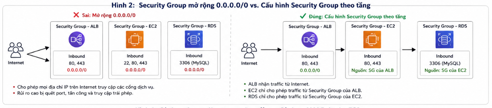
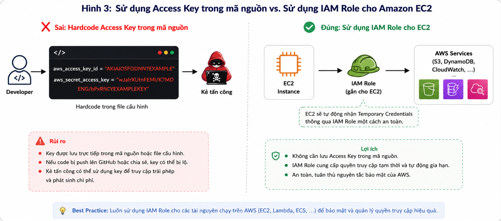

# 7 Common Mistakes Beginners Make When Deploying Their First Web Application on AWS

While learning and deploying a web application on AWS, I realized that successfully creating Amazon EC2 or Amazon RDS is only the beginning. What matters more is understanding how services work together, how to build a secure architecture, and how to choose the right solution for each problem.

When I first started, I thought that as long as the application could run, it was enough. However, after reading AWS documentation and practicing deployment, I realized that many small-looking mistakes can directly affect system security, scalability, and operating costs.

Below are common mistakes that I have encountered or often see among beginners learning AWS. I hope these experiences help others avoid similar issues when deploying systems.

---

### 1. Placing All Resources in Public Subnets

When I first learned about Amazon VPC, I thought placing Amazon EC2 and Amazon RDS in Public Subnets would be more convenient because I could access them directly from the Internet for testing and configuration.

> **Figure 1. Comparison between an insecure architecture and a recommended Public/Private Subnet architecture.**

In reality, this is a major security risk. Public Subnets should only contain components that need direct communication with the Internet, such as an Application Load Balancer or NAT Gateway. Important resources such as Amazon EC2 and Amazon RDS should be deployed in Private Subnets to limit direct external access.

> **Best Practice:** Design the network using a Public/Private Subnet model. Only services that need to receive or route Internet traffic should be placed in Public Subnets.

---

### 2. Opening Security Groups Too Broadly

A common mistake is configuring Security Groups with the source address `0.0.0.0/0` for many service ports just to make the system work quickly.

> **Figure 2. Comparison between an insecure Security Group configuration and a configuration based on the Least Privilege principle.**

This configuration makes testing easier, but it also significantly increases the risk of unauthorized access. Instead, each service should only allow the required source to connect. For example, the Application Load Balancer receives traffic from the Internet, Amazon EC2 only allows connections from the Load Balancer's Security Group, and Amazon RDS only allows connections from the EC2 Security Group.

> **Best Practice:** Apply the **Least Privilege** principle by granting only the minimum access needed for each component in the system.

---

### 3. Using Access Keys Instead of IAM Roles

At first, I thought storing Access Key and Secret Access Key in a configuration file was the simplest way for an application to access Amazon S3.

> **Figure 3. Comparison between storing Access Keys in source code and using an IAM Role for Amazon EC2.**

However, if the source code is accidentally made public or the project is shared, these access keys may be exposed and lead to unauthorized use of the AWS account. For services running on AWS, such as Amazon EC2, the better solution is to use an IAM Role. IAM Roles automatically provide temporary credentials so applications can access AWS services without storing fixed access keys in the source code.

> **Best Practice:** Do not store Access Keys in source code. For EC2, Lambda, or ECS, use IAM Roles to manage access permissions.

---

### 4. Storing Images and Files Directly on EC2

When developing a web application, I once stored all images and uploaded files directly on the EC2 server, similar to running the application locally.

However, Cloud architecture aims for a **Stateless** model. If an EC2 instance fails or is replaced by Auto Scaling, data stored on the server may no longer be available. Instead of storing files directly on EC2, Amazon S3 is a more suitable choice because it provides durable storage, flexible scalability, and easy integration with other AWS services.

> **Best Practice:** Use Amazon S3 to store images, documents, and static files instead of storing them directly on the EC2 disk.

---

### 5. Confusing Region, Availability Zone, and VPC

When I first studied AWS, I often confused Region, Availability Zone (AZ), and VPC. This led to inaccurate architecture diagrams or incorrect placement of some services.

After studying more, I realized that a Region is the geographic area where services are deployed, an Availability Zone is an independent data center inside a Region, and a VPC is a virtual private network created within a Region that can span multiple AZs. Meanwhile, services such as Amazon S3 operate at the Regional level, while AWS IAM is a Global service. Understanding the scope of each service helps create accurate architecture designs and avoid many deployment errors.

> **Best Practice:** Before designing a system, clearly identify whether each service operates at the Global, Regional, or VPC level so that the architecture can be arranged properly.

---

### 6. Not Monitoring the System After Deployment

Another mistake is focusing only on deploying the application and forgetting to monitor system health.

When the application has errors or slow responses, not having logs and monitoring metrics makes troubleshooting very difficult. Amazon CloudWatch supports log collection, CPU monitoring, network traffic tracking, disk usage monitoring, and alert configuration when the system shows abnormal signs. Monitoring from the beginning helps detect incidents early and significantly reduces troubleshooting time.

> **Best Practice:** Configure Amazon CloudWatch from the start of deployment to monitor logs, performance, and alerts when needed.

---

### 7. Using Too Many AWS Services Before They Are Needed

When I first learned AWS, I thought a professional architecture needed CloudFront, WAF, Auto Scaling, ElastiCache, and many other services.

However, each service increases cost, complexity, and operational effort. For learning projects or small systems, using too many services is unnecessary. In my view, a good architecture is not the one with the most services, but the one that meets current requirements and can still scale flexibly in the future.

> **Best Practice:** Start with a simple architecture, then add services only when the system truly needs them.

---

# Lessons Learned

After learning and deploying applications on AWS, I realized that understanding individual services is not enough. What matters more is knowing how to combine them into an architecture that fits the system requirements.

The three principles I always keep in mind are:

- **Design security from the beginning:** Separate Public Subnets and Private Subnets, and use Security Groups and IAM Roles correctly.
- **Design for scalability:** Separate the application processing layer, database, and static data storage to make future upgrades easier.
- **Choose suitable services:** Avoid deploying too many services if the application does not truly need them, in order to reduce costs and simplify management.

These principles help the architecture remain secure, easy to operate, and ready to scale as the system grows.

# Conclusion

Making mistakes when learning AWS is very normal. What matters more is understanding the cause of each issue and gradually improving the architecture based on AWS recommendations.

Through deployment practice and document research, I realized that a good system not only needs to run stably but also needs to ensure security, scalability, and cost optimization. I hope the experiences shared in this article help beginners avoid common mistakes and become more confident when deploying their first application on AWS.
