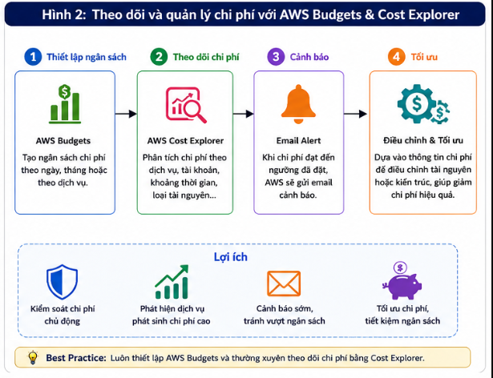
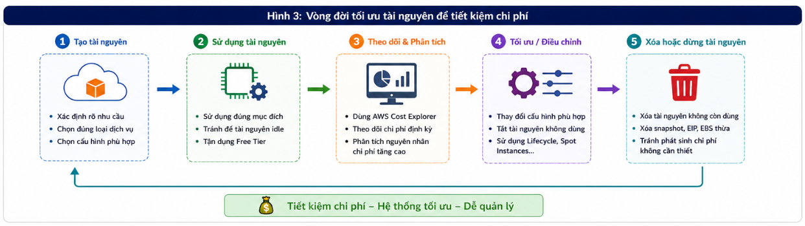

# 7 Ways to Optimize Costs When Deploying Applications on AWS

One of the biggest lessons I learned after studying and deploying applications on AWS is that **cost must be considered from the system design stage**. At first, I focused only on making the application run stably. However, when I started using more services, I realized that if resources are not managed properly, costs can become higher than expected.

According to the **AWS Well-Architected Framework**, **Cost Optimization** is one of the important pillars alongside security, reliability, performance efficiency, operational excellence, and sustainability. This shows that cost optimization is not about mechanically cutting resources. It is about using the right service, with the right configuration, at the right time.

In this article, I share seven practical experiences for optimizing costs when deploying applications on AWS, especially for students and beginners learning about cloud computing.

---

## 1. Use Services Only When They Are Truly Needed

When I first learned AWS, I was overwhelmed by the number of services the platform provides. Because I wanted the architecture to look more "professional", I once thought that the system should include CloudFront, AWS WAF, Auto Scaling, NAT Gateway, and Amazon ElastiCache from the beginning.

However, for small applications or student projects, using too many services does not bring much value. It increases cost and makes system management more complex.

> **Figure 1. Comparison between an architecture with too many services and a minimal architecture based on the "Start Simple, Scale Later" principle.**

> **Best Practice:** Deploy only the services that truly meet the current system requirements. When traffic increases or new needs appear, expand the architecture gradually.

---

## 2. Take Advantage of AWS Free Tier

AWS Free Tier provides many services for free within certain limits, such as Amazon EC2, Amazon S3, Amazon RDS, and AWS Lambda. This is a very useful resource for learning, practicing, and building small projects.

During use, I always check whether the selected service and configuration are still within the Free Tier limits before creating resources.

> **Best Practice:** Always check the AWS Free Tier policy before creating resources to reduce unexpected charges.

---

## 3. Stop or Delete Resources That Are No Longer Used

After completing labs or tests, many people forget to clean up the resources they created on AWS.

For example:

- Amazon EC2 may still generate Amazon EBS storage costs even after it is stopped.
- Elastic IP addresses that are not attached to a running EC2 instance are still charged.
- Snapshots or unused EBS Volumes continue to generate storage costs.

Regularly checking and cleaning up resources helps significantly reduce operating costs.

> **Best Practice:** After each lab or test deployment, check and delete resources that are no longer used.

---

## 4. Monitor Costs with AWS Budgets and AWS Cost Explorer

Cost control should be performed regularly instead of waiting until the end of the month to check the bill.

AWS Budgets allows you to set budgets and send email alerts when costs exceed the configured threshold. Meanwhile, AWS Cost Explorer provides visual charts that help track costs by service, account, or time period.

With these two tools, I can quickly identify which service is consuming too much cost and adjust it in time.

> **Figure 2. Cost monitoring and management process using AWS Budgets and AWS Cost Explorer.**

> **Best Practice:** Set up AWS Budgets from the beginning of the project and regularly monitor costs using AWS Cost Explorer.

---

## 5. Choose the Right Resource Configuration (Right-sizing)

In cloud computing, the most powerful configuration is not always the best choice. What matters is choosing a configuration that fits real needs.

For learning environments or small websites, Amazon EC2 instance types such as `t2.micro` or `t3.micro` are often sufficient. Similarly, many applications only need Amazon RDS MySQL instead of Aurora.

Choosing the right configuration helps use resources efficiently and significantly reduces operating costs.

> **Best Practice:** Start with a small configuration, monitor performance, and upgrade only when the system truly needs it.

---

## 6. Manage Data Lifecycle and Optimize Storage

Storage capacity grows over time, which is another reason costs can increase.

For Amazon S3, I often configure **Lifecycle Rules** to automatically move infrequently accessed data to lower-cost storage classes such as **S3 Glacier Flexible Retrieval** or **S3 Glacier Deep Archive**. At the same time, I regularly check and delete unused Snapshots or EBS Volumes.

> **Best Practice:** Use Lifecycle Rules for Amazon S3 and periodically clean up storage resources that are no longer needed.

---

## 7. Choose a Suitable Region and Keep the Design Simple Before Scaling

The cost of the same AWS service can differ between Regions. Therefore, choosing the right Region not only reduces latency but also helps optimize cost.

In addition, I realized that a simple architecture with Amazon EC2, Amazon RDS, Amazon S3, and an Application Load Balancer is enough for most small applications. Only when the system grows and has more users should services such as Auto Scaling, CloudFront, or AWS WAF be added.

> **Figure 3. Resource and cost optimization process throughout the AWS system deployment lifecycle.**

> **Best Practice:** Apply the **Start Simple, Scale Later** principle and expand the system only when there is a real need.

---

# Lessons Learned

Through learning and practicing AWS, I realized that cost optimization is not simply about reducing the budget. It is about using resources reasonably and effectively.

Some lessons I learned include:

- Deploy only the services that are truly necessary.
- Make the most of AWS Free Tier during learning.
- Regularly clean up resources that are no longer used.
- Monitor costs using AWS Budgets and AWS Cost Explorer.
- Choose the right resource configuration and Region.
- Design a simple architecture first, then expand when the system grows.

These principles are also the foundation of the **Cost Optimization** pillar in the AWS Well-Architected Framework.

---

# Conclusion

Cost optimization is an important skill when deploying systems on AWS. A good architecture not only ensures performance, security, and scalability, but also uses resources reasonably to avoid unnecessary costs.

For me, building the habit of monitoring costs, choosing the right services, and managing resources from the beginning made the process of learning and deploying applications on AWS much more effective. I hope the experiences shared in this article help beginners gain a more practical perspective on designing systems that meet technical requirements while optimizing the deployment budget.
