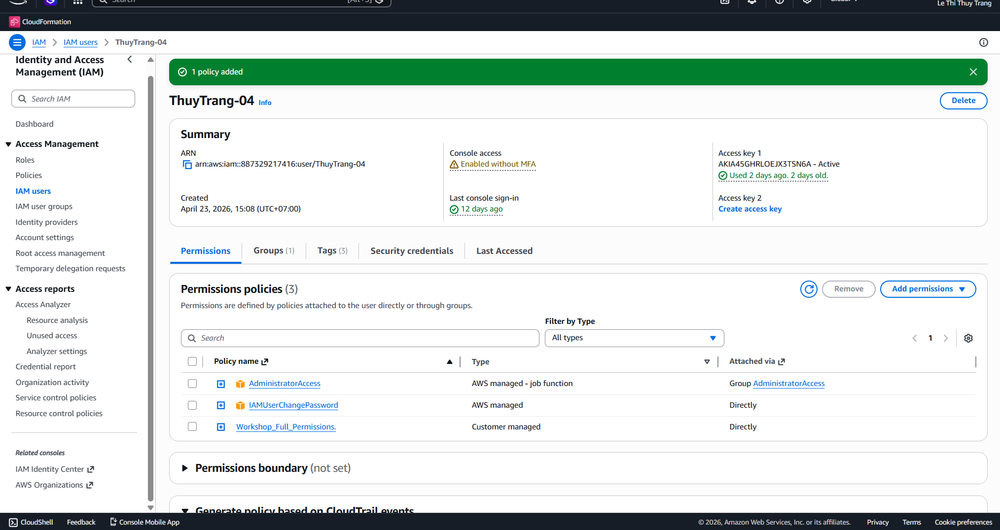

#### IAM permissions
Gắn IAM permission policy sau vào tài khoản aws user của bạn để triển khai và dọn dẹp tài nguyên trong workshop này.

#### Khởi tạo tài nguyên bằng CloudFormation

Trong lab này, chúng ta sẽ dùng N.Virginia region (us-east-1).

Để chuẩn bị cho môi trường làm workshop, chúng ta deploy CloudFormation template sau (click link): [PrivateLinkWorkshop ](https://us-east-1.console.aws.amazon.com/cloudformation/home?region=us-east-1#/stacks/quickcreate?templateURL=https://s3.us-east-1.amazonaws.com/reinvent-endpoints-builders-session/Nested.yaml&stackName=PLCloudSetup). Để nguyên các lựa chọn mặc định.

+ Lựa chọn 2 mục acknowledgement 
+ Chọn Create stack

Quá trình triển khai CloudFormation cần khoảng 15 phút để hoàn thành.

+ 2 VPCs đã được tạo

+ 3 EC2s đã được tạo

