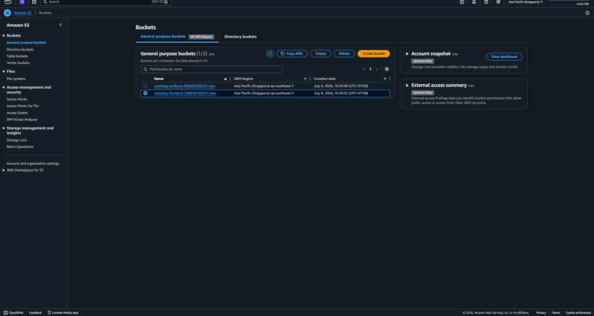

```markdown
---
title : "Triển khai Amazon S3"
date : 2026-07-10
weight : 3
chapter : false
pre : " <b> 5.3. </b> "
---

## Tổng quan

Trong chương này, chúng ta sẽ tạo một **Amazon S3 Bucket** để lưu trữ mã nguồn Frontend của hệ thống **AWS_OmniStay**. Bucket sẽ được cấu hình ở chế độ **Private** và được sử dụng làm Origin cho Amazon CloudFront ở các chương tiếp theo.

---

## Nội dung thực hiện

### Bước 1: Tạo S3 Bucket

- Đăng nhập **AWS Management Console**.
- Tìm kiếm **Amazon S3**.
- Chọn **Create bucket**.


Cấu hình:

- **Bucket name:** `aws-omnistay-frontend`
- **Region:** Asia Pacific (Singapore) `ap-southeast-1`
- **Bucket type:** General purpose

📷 **Chụp hình:**

- Giao diện tạo Bucket (`create-bucket.png`)

---

### Bước 2: Cấu hình Bucket

Giữ nguyên các thiết lập mặc định:

- Block all public access: **Enable**
- Bucket Versioning: **Enable**

Sau đó chọn **Create bucket**.

📷 **Chụp hình:**

- Cấu hình Block Public Access (`bucket-setting.png`)

---

### Bước 3: Kiểm tra Bucket

Sau khi Bucket được tạo thành công, kiểm tra:

- Bucket đã xuất hiện trong danh sách.
- Region là `ap-southeast-1`.
- Public Access được Block.

📷 **Chụp hình:**

- Danh sách Bucket (`bucket-list.png`)

---

## Kết quả

Đến bước này, Amazon S3 Bucket đã được tạo thành công và sẵn sàng lưu trữ mã nguồn Frontend của hệ thống AWS_OmniStay. Trong chương tiếp theo, chúng ta sẽ tải mã nguồn từ máy tính cục bộ lên Amazon S3.
```

